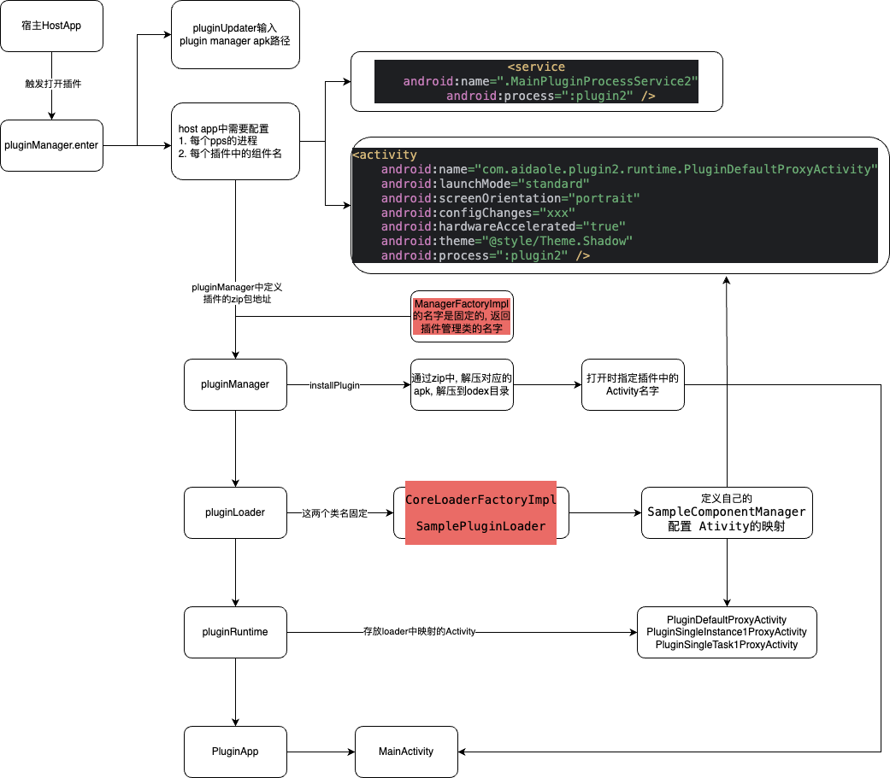

# Shadow

## 介绍

这个项目是 fork 自腾讯的开源框架 Shadow, 源地址: [https://github.com/Tencent/Shadow](https://github.com/Tencent/Shadow)

本项目的目的是简化一下shadow的使用, 并记录一下使用中遇到的问题, 原项目中结构还是相对比较复杂

## 编译通过

clone 项目之后, 如果你的Android Studio比较新, 默认使用的gradle编译环境应该是jdk17, 需要修改为 jdk 11才能编译, 修改位置:


修改之后应该就可以直接 Sync 通过, 可以直接跑起来 `sample-app` 了

## 运行一个自己的宿主和插件

在简单的印象中, 插件化就应该是一个宿主,对应多个插件的结构, 第一眼使用Shadow的时候还是有点懵, 不知道应该怎么操作. 可以参考源地址: [README](./projects/sample/README.md)

我们这里以不修改 Shadow 框架的情况, 直接依赖对应产物的方式来实现1个宿主对应2个插件的例子

### 1. 编译自己的shadow sdk版本

参考 [README](./projects/sample/README.md), 修改 `buildScripts/maven.gradle` 中的 `coreGroupId` 和 `dynamicGroupId` 将发布包名修改为自己的
当然也可以什么都不修改直接发布, 包名默认用的就是tencent的

在根目录下执行 `./gradlew publish` 可以在maven local中看到生成的产物, 主要是 `core` 和 `dynamic` 

### 2. 添加宿主工程

在项目中的 demo 目录下, 我添加了 `demo-host` 作为宿主, 代码可以直接参考 `projects/sample/maven/host-project` 下的代码
主要依赖 `com.tencent.shadow.dynamic:host:2.3.0`

### 3. 创建插件工程

这里需要注意, 插件中下载器(plugin-manager)和插件的代码是分开的, 所以我们先创建插件下载器. 我这里采用的结构是 宿主一个module, 插件的都放在一个文件夹下,如下:

```
demo
    - demo-host
    - demo-plugin1
        - plugin1-manager # 插件下载器
        
        - plugin1-app     # 插件需要拆分成 app, loader, runtime
        - plugin1-loader
        - plugin1-runtime
```

目前插件中的代码, 主要是从 [maven](projects/sample/maven) 中copy出来的

需要注意一个点插件打包的配置:

```
shadow {
    packagePlugin {
        pluginTypes {
            debug {
                // 配置loader 项目编译, 以及 apk名字
                loaderApkConfig = new Tuple2('plugin1-loader-debug.apk', ':demo:demo-plugin1:plugin1-loader:assembleDebug')
                // 配置runtime 项目编译, 以及 apk名字
                runtimeApkConfig = new Tuple2('plugin1-runtime-debug.apk', ':demo:demo-plugin1:plugin1-runtime:assembleDebug')
                pluginApks {
                    pluginApk1 {
                        businessName = 'demo-plugin1' //businessName相同的插件，context获取的Dir是相同的。businessName留空，表示和宿主相同业务，直接使用宿主的Dir。
                        partKey = 'demo-plugin1'
                        buildTask = 'assemblePluginDebug'
                        // 插件apk路径
                        apkPath = 'demo/demo-plugin1/plugin1-app/build/outputs/apk/plugin/debug/plugin1-app-plugin-debug.apk'
                    }
                }
            }
        }

        loaderApkProjectPath = 'demo/demo-plugin1/plugin1-loader' // 配置到plugin1-loader根目录
        runtimeApkProjectPath = 'demo/demo-plugin1/plugin1-runtime' // 配置到plugin1-loader根目录

        version = 4
        compactVersion = [1, 2, 3]
        uuidNickName = "1.1.5"
    }
}
```

`./gradlew packageDebugPlugin` 的时候会自动触发loader和runtime的编译, 并且将插件apk一起打包到 plugin-debug.zip 中

**编译和push脚本**

这里为了方便快速验证, 在根目录下建了 [build.sh](build.sh) 方便快速编译 plugin 和 plugin-manager, push到手机上

**注意:** 

[demo-plugin1](demo/demo-plugin1) 插件1 是以module形式放在项目结构中的, 

[demo-plugin2](demo/demo-plugin2) 插件2 是一个独立的项目, 需要单独使用AndroidStudio open打开

项目中已经实现在一个host中同时打开两个插件

### 4. 梳理打开流程



这里梳理了shadow对 host, plugin-manager, plugin-app, plugin-loader, plugin-runtime 几个关系的梳理和依赖关系

图中一些标红的类(固定类名)是使用反射工作的, 所以需要注意添加keep


